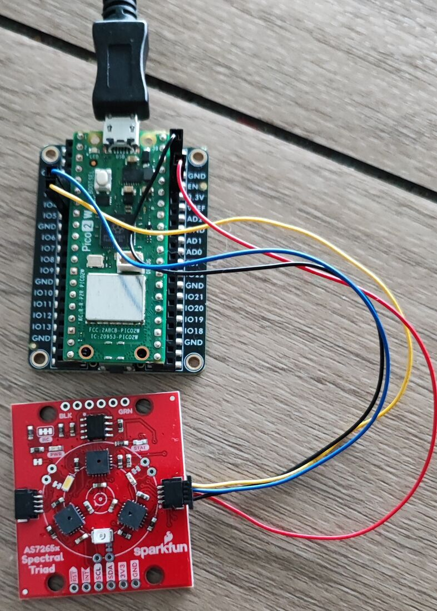
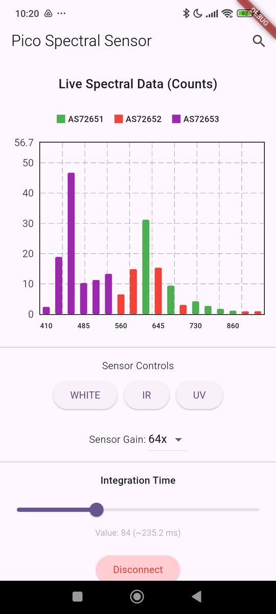

# Flutter AS7265x Spectroscopy App

This repository contains a Flutter mobile application for 18-channel spectroscopy. It uses **Bluetooth Low Energy (BLE)** to communicate with a **Raspberry Pi Pico 2W** connected to an **AS7265x spectral sensor**.

## 📷 Photo & Screenshot

## 🛠️ Hardware Overview

The system utilizes the [**AS7265x Spectral Triad**](https://github.com/sparkfun/Qwiic_Spectral_Sensor_AS7265x) to capture light across the NIR (Near-Infrared), VIS (Visible), and UV (Ultraviolet) spectrums. The Raspberry Pi Pico 2W serves as the BLE (Bluetooth Low Energy) peripheral, transmitting sensor data to the mobile app.

### Wiring Diagram

| AS7265x Pin | Pico 2W Pin |GPIO| Function |
| :--- | :--- | :--- | :--- |
| 3.3V | 3V3 (Pin 36) |	- |	Power (2.7V - 3.6V) |
| GND |	GND (Pin 38) |	-        | Ground      |
| SDA |	GP4 (Pin 6)  |	GPIO 4	 | I2C0 Data   |
| SCL |	GP5 (Pin 7)  |	GPIO 5   | 	I2C0 Clock |

## 📡 BLE GATT Profile

The Pico 2W acts as a peripheral, exposing a custom service (`0xFF00`).

### Data Characteristics (NOTIFY)

Each characteristic transmits 24 bytes, consisting of 6 IEEE 754 Little Endian floats.

* **NIR AS72651 (0xFF01):** 610, 680, 730, 760, 810, 860 nm.
* **VIS AS72652 (0xFF02):** 560, 585, 645, 705, 900, 940 nm.
* **UV AS72653 (0xFF03):** 410, 435, 460, 485, 510, 535 nm.

### Control Characteristic (WRITE)

UUID: `0xFF04` accepts a 2-byte packet: `[Command ID] [Value]`.

* `0x01:` Set Gain (0=1x, 1=3.7x, 2=16x, 3=64x).
* `0x02:` Set Integration Time (Value × 2.8ms).
* `0x03:` Toggle White LED (1=On, 0=Off).
* `0x04:` Toggle IR LED (1=On, 0=Off).
* `0x05:` Toggle UV LED (1=On, 0=Off).

### Temperature Characteristic (READ)
UUID: `0xFF05`
Returns a 3-byte array of signed 8-bit integers (`int8_t`) representing the internal chip temperatures in Celsius for the NIR, VIS, and UV sensors, respectively.

## 📱 Flutter Application

The mobile app is built using **Flutter** and **Cubit (BLoC)** for state management.

### Key Features

* **Live Bar Chart:** Visualizes all 18 channels simultaneously using `fl_chart`.
* **Device Discovery:** Scans specifically for "Pico-Spectral" devices or the custom service UUID.
* **Dynamic Controls:** Real-time adjustment of sensor gain, integration time (via slider), and LED toggles.
* **Data Export:** Save captured spectra, sensor settings, and sensor temperatures to **JSON** using `file_picker`.
* **Robust BLE:** Uses `flutter_blue_plus` for reliable communication and notification handling.

## 🚀 Getting Started

**1. Firmware (Pico 2W)**
* See [Pico 2W AS7265x Spectral Sensor BLE Server/Peripheral](https://github.com/IoT-gamer/pico_as7265x_ble_server) for setup instructions.

**2. Mobile App (Flutter)**
* Clone this repository.
* Navigate to the `flutter_as7265x_spectroscopy_app` folder.
* Run `flutter pub get` to install dependencies like `flutter_bloc` and `flutter_blue_plus`.
* Connect an Android or iOS device and run `flutter run`.
* Grant Bluetooth and Location permissions when prompted.

## 📜 License
This project is licensed under the MIT License. See the [LICENSE](LICENSE) file for details.